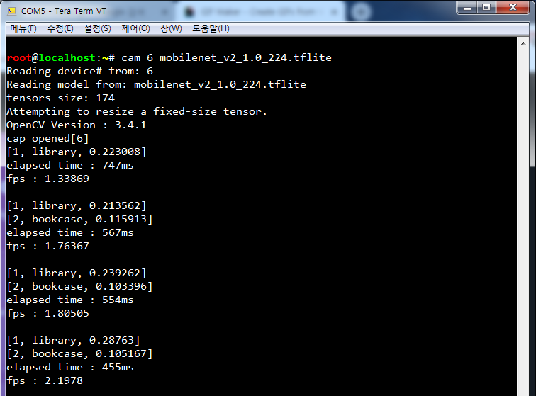

* 타이젠에서 tflite를 사용하여 webcam 영상에 대한 object detection을 하는 방법
  * webcam device # 확인
    * [how_to_check_usb_webcam](https://github.com/kosslab-kr/Tizen-NN-Runtime/blob/master/docs/how_to_check_usb_webcam.md)
  * openCV functions
    * openCV를 사용하여 webcam 연동
      ```
      cv::VideoCapture cap;
      cap.open(cam_num);
      ```
    * device가 open 됐는지 확인
      ```
      cap.isOpened();
      ```
    * 한 프레임 저장
      ```
      cv::Mat frame;
      cap >> frame;
      ```
    * frame resize
      ```
      cv::Mat frame, resized_frame;
      cv::resize(frame, resized_frame, cv::Size(width, height));
      ```
    * 프레임을 BGR 형식에서 RGB 형식으로 변환
      ```
      cv::Mat resized_frame, rgb_frame;
      cv::cvtColor(resized_frame, rgb_frame, cv::COLOR_BGR2RGB);
      ```
  * Model 수행은 다음과 같은 순서로 이루어진다.
    1. FlatBufferModel 기반으로 Interpreter 빌드
    2. 필요시 input tensor를 resize (input size가 미리 정의되지 않을 경우)
    3. input tensor 값 입력
    4. inference 수행
    5. output tensor 값 읽기
  * openCV로 읽어온 webcam frame은 RGB 채널값이 BGR 순서로 저장되어 있다.
  CNN 모델의 경우 일반적으로 width * height * channel 크기의 input tensor에 frame을 RGB 순서로 값을 입력해야 하기 때문에 순서 변환이 필요하다.
  
    각 RGB값을 0 ~ 1 사이의 값으로 normalization이 필요한 경우, 각 RGB 값을 255.0으로 나눈값으로 input tensor에 넣어주어야 한다.
  아래는 상기 동작에 대한 코드이다.
    ```
    cv::Mat resized_frame, rgb_frame;
    const float input_std = 255.0f; // for normalziing
       
    // BGR to RGB 변환
    cv::cvtColor(resized_frame, rgb_frame, cv::COLOR_BGR2RGB);
        
    // cam frame 각 pixel의 rgb 값을 normalize 하여 model input tensor에 입력
    for(int i = 0; i < SIZE * SIZE * 3; ++i)
        out[i] = rgb_frame.data[i] / input_std;
    ```
  *  아래는 webcam frame을 읽어서 model을 수행하는 대략적인 코드이다.
  
    PrintTopN 함수에서 output tensor의 상위 N개 값에 대한 label을 출력하면 Top-N Object Detection이 된다.
    ```
    // FlatBufferModel에 model 로드
    std::unique_ptr<tflite::FlatBufferModel> model(tflite::FlatBufferModel::BuildFromFile(filename));
    
    // operation 관련 객체?
    tflite::ops::builtin::BuiltinOpResolver resolver;
    
    // model 해석을 위한 Interpreter 객체 및 할당
    std::unique_ptr<tflite::Interpreter> interpreter;
    tflite::InterpreterBuilder(*model, resolver)(&interpreter);
    
    // 필요한 경우 input tensor size 변경
    //    interpreter->ResizeInputTensor(0, sizes);
    
    // memory allocation for input and output tensors
    interpreter->AllocateTensors();
    
    float* out = interpreter->typed_input_tensor<float>(0); // model input
    const float input_std = 255.0f; // for normalziing
    
    cv::VideoCapture cap;
    cap.open(cam_num); // open webcam
    
    if(cap.isOpened()) // device가 open 됐는지 확인
    {
        while() {
            cap >> frame; // 한 프레임 저장

            // cnn의 input size에 맞게 resize
            cv::resize(frame, resized_frame, cv::Size(SIZE, SIZE)); // resize for cnn
        
            // BGR to RGB 변환
            cv::cvtColor(resized_frame, rgb_frame, cv::COLOR_BGR2RGB);
        
            // cam frame 각 pixel의 rgb 값을 normalize 하여 model input tensor에 입력
            for(int i = 0; i < SIZE * SIZE * 3; ++i)
                out[i] = rgb_frame.data[i] / input_std;
                
            interpreter->Invoke(); // run model
    
            float* output = interpreter->typed_output_tensor<float>(0); // model output
            PrintTopN(output); // output 중 상위 N개의 결과 출력
            
            usleep(10);
        }
    }
    ```
  * 동작 화면
    
