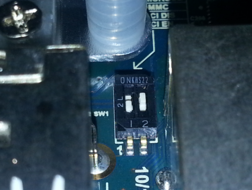

## How to setup XU3 with Ubuntu 16.04

Ref: https://wiki.odroid.com/old_product/odroid-xu3/odroid-xu3

MicroSD card images
- https://dn.odroid.com/5422/ODROID-XU3/Ubuntu/

Latest image (as of writing this file)
- https://dn.odroid.com/5422/ODROID-XU3/Ubuntu/ubuntu-16.04.3-4.14-minimal-odroid-xu4-20171213.img.xz
- Flash with `WinFlashTool`

MicroSD boot DIP settings
- 

SW1-1,2 | 1st Boot media
-- | --
ON ON | eMMC
OFF ON | MicroSD card

Boot
- login with serial console
- password: `root`/`odroid`

Set ethernet
`/etc/network/interfaces`
```
# interfaces(5) file used by ifup(8) and ifdown(8)
# Include files from /etc/network/interfaces.d:
source-directory /etc/network/interfaces.d

auto lo eth0
iface lo inet loopback

iface eth0 inet static
	address 10.113.xxx.yyy
	netmask 255.255.255.0
	network 10.113.xxx.0
	broadcast 10.113.xxx.255
	gateway 10.113.xxx.1
	dns-nameservers 10.32.192.11 10.32.193.11 8.8.8.8
```
Change `xxx.yyy` to your IP address.

Reboot and login with SSH

### Add proxy settings

Add `/etc/apt/apt.conf.d/90proxies`
```
Acquire::http::proxy "http://10.112.1.184:8080/";
Acquire::https::proxy "http://10.112.1.184:8080/";
Acquire::ftp::proxy "ftp://10.112.1.184:8080/";
```

Add `/etc/profile.d/proxy.sh`
```
#!/bin/bash

# Proxy
export HTTP_PROXY=http://10.112.1.184:8080/
export HTTPS_PROXY=https://10.112.1.184:8080/
```

### Update and install programs

```
sudo apt-get update
sudo apt-get upgrade
sudo apt-get install vim nfs-common
```

### For convenience

Edit `~/.profile`
```
export LD_LIBRARY_PATH=$LD_LIBRARY_PATH:.
```

### MALI GPU driver

https://developer.arm.com/products/software/mali-drivers/user-space

Download at `Odroid-XU3` section
- https://developer.arm.com/-/media/Files/downloads/mali-drivers/user-space/odroid-xu3/malit62xr12p004rel0linux1fbdev.tar.gz?revision=b4f9b859-ac02-408e-9729-c1e50d3a9c6c

Extract and copy to `/usr/lib/fbdev`

File list
```
$ll /usr/lib/fbdev/

total 22520
drwxr-xr-x  2 root root     4096 Feb 21 02:35 ./
drwxr-xr-x 57 root root     4096 Feb 21 08:33 ../
lrwxrwxrwx  1 root root       11 Feb 21 02:35 libEGL.so -> libEGL.so.1*
lrwxrwxrwx  1 root root       10 Feb 21 02:35 libEGL.so.1 -> libmali.so*
lrwxrwxrwx  1 root root       17 Feb 21 02:35 libGLESv1_CM.so -> libGLESv1_CM.so.1*
lrwxrwxrwx  1 root root       10 Feb 21 02:35 libGLESv1_CM.so.1 -> libmali.so*
lrwxrwxrwx  1 root root       14 Feb 21 02:35 libGLESv2.so -> libGLESv2.so.2*
lrwxrwxrwx  1 root root       10 Feb 21 02:35 libGLESv2.so.2 -> libmali.so*
lrwxrwxrwx  1 root root       14 Feb 21 02:35 libOpenCL.so -> libOpenCL.so.1*
lrwxrwxrwx  1 root root       10 Feb 21 02:35 libOpenCL.so.1 -> libmali.so*
-rwxr-xr-x  1 root root 21471208 Feb 21 02:35 libmali.so*
-rwxr-xr-x  1 root root  1580048 Feb 21 02:35 liboffline_compiler_api.so*
```

Add `/etc/ld.so.conf.d/malifbdev.conf`
```
# arm mali
/usr/lib/fbdev
```

Rename `arm-linux-gnueabihf_EGL.conf` to `arm-linux-gnueabihf_EGL.conf.not`
- This is to disable mesa (software emulator of EGL)
