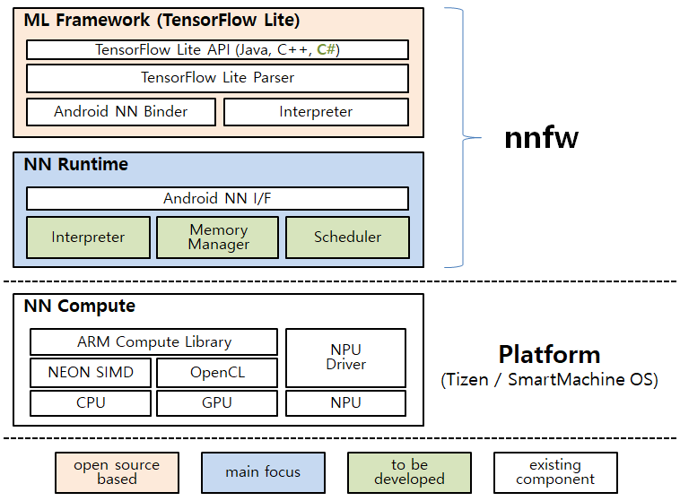

This document describes roadmap of 2018 NN Runtime (or _nnfw_) project.

# Goal
This project _nnfw_ aims at providing a high-performance, on-device neural network (NN) inference
framework that performs inference of a given NN model on processors, such as CPU, GPU, or NPU, in
the target platform, such as Tizen and SmartMachine Platform (SMP).

# Architecture

The figure above illustrates the overall architecture and scope of _nnfw_, which consists of ML
Framework and NN Runtime, as well as NN Compute that is provided by the platform:
1. ML Framework
   - Provide TensorFlow (TF) Lite on Tizen and SMP
      - We chose TF Lite as a standard ML framework in _nnfw_ for this year, since TF Lite is
        lightweight compared to other ML frameworks and its community is rapidly growing. We expect
        supporting TF Lite on Samsung's OS platforms would be beneficial to Samsung's diverse
        business areas and AI solutions.
   - Provide TF Lite C# API for Tizen .NET
      - Considering the existing TF Lite supports only C++ and Java API, C# API for TF Lite would
        be a great complement to TF Lite and natural extension for Tizen.
1. NN Runtime
   - Provide a common runtime interface, which is Android NN API
      - Android NN API (NN API for short) was selected for seamless integration with TF Lite. As
        long as our NN runtime provides NN API as an interface, TF Lite can link to our NN runtime
        without any modification.
      - Although we borrowed NN API as the runtime's interface, we plan to design and implement the
        runtime itself by ourselves. For the implementation, we will utilize ARM Compute Library
        (ACL) for NN operation acceleration on ARM CPU and GPU.
1. NN Compute
   - Provide computation acceleration library, such as ACL, or device driver for NPU
   - This layer will be provided by OS platform, and we will use the library or device driver as it
     is. We may request a specific version to the Platform team, but we don't expect we will be
     modifying the library.

# Deliverables
- On-Device AI SW Stack (a.k.a STAR Lite) for Tizen
- On-Device AI SW Stack for SMP
- ML Framework that can run ADAS models

# Milestones
## Project Milestones
- Support all 50 TF Lite operations on ARM CPU and GPU
- Support all 29 operations of NN API on ARM CPU and GPU
- Support InceptionV3 and MobileNet, written in TF Lite model format, on ARM CPU and GPU

## Monthly Milestones
(These will be updated as we proceed with the project and can estimate development time more
accurately.)
- March: Set up milestones, tasks, workgroups, initial code structure, and build/test infra
- April: Run InceptionV3 using ACL on the Tizen TM2 and ODroid XU4
   - Mid of April: Establish a full SW stack that is ready to run InceptionV3
- May: Run MobileNet on Tizen / Tizen M1 release
- June: Run ADAS models on Tizen / STAR Platform 2nd release
- September: Tizen M2 release / STAR Platform 3rd release
- October: SMP v1.0 release / STAR Platform v1.0 release

# Tasks
Below is an overall list of major topics (tasks) throughout the project this year. For the details
of each topic, please visit each topic's issue page.
Please note that the list might not be complete and thus it could be updated as we make progress in
the project and discuss more about the implementation details.

## ML Framework
### Technical Goals
- Provide TF Lite on Tizen and SMP
- Develop TF Lite C# API for Tizen .NET

### Milestones
- March
   1. Enable Tizen build / C# API / test code
   1. Complete enabling Tizen build and test codes / Test infra / Benchmark
- Mid April
   1. Complete all tasks needed to run InceptionV3
- May
   1. Support custom operators to run ADAS models
   1. Complete all test codes and benchmarks

### Tasks
- Visit [#74](https://github.sec.samsung.net/STAR/nnfw/issues/74) for the list of tasks, issue
  tracking, and discussions.

## NN Runtime
- NN Runtime is an actual implementation of NN API.

### Technical Goals
- Develop an NN model interpreter targeting ARM CPU and GPU
- Develop a device memory manager
- Develop an operation scheduler supporting both CPU and GPU

### Milestones
- March: Run simple NN with CPU backend
   1. Prepare a working vertical SW stack of NN runtime
- Mid of April (for testing): Run InceptionV3 with ACL backend and CPU backend
   1. Evaluate performance of InceptionV3 and improve performance for ADAS if necessary
- May (Tizen M1)
   1. Optimize NN runtime (improving interpreter or using IR from
      [nncc](https://github.sec.samsung.net/STAR/nncc))
   1. Implement more operators of NN API

### Tasks
- Visit [#72](https://github.sec.samsung.net/STAR/nnfw/issues/72) for the list of tasks, issue
  tracking, and discussions.

## NN API Operations
### Technical Goals
- Implement NN operations optimized for ARM CPU and GPU

### Milestones
- March: Run convolution using `tflite_run`
   - Test framework: ?
- Mid of April : InceptionV3 complete on CPU/GPU
   - For ADAS, we need to make the performance to be goods as we can make.
- May: optimized kernels for InceptionV3 on CPU/GPU

### Tasks
- Visit [#73](https://github.sec.samsung.net/STAR/nnfw/issues/73) for the list of tasks, issue
  tracking, and discussions.

# Workgroups (WGs)
- We organize WGs for major topics above, and each WG will be working on its own major topic by
  breaking it into small tasks/issues, performing them inside WG, and collaborating between WGs.
- The WG information can be found [here](workgroups.md).
